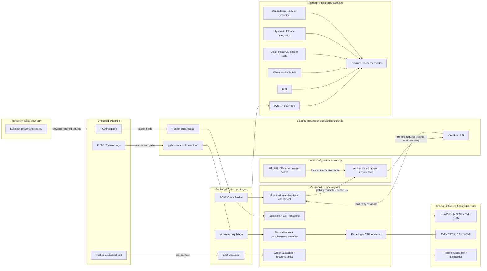

# Security Tools Architecture

This repository contains three independently installable defensive-analysis packages behind a shared governance and verification layer.

## Trust boundaries

1. Inputs and resulting report fields are attacker influenced. Extracted strings are never trusted merely because a parser accepted them.
2. TShark, `python-evtx`, and the Windows PowerShell fallback are separate parser/process boundaries whose failures must be surfaced.
3. Reports are analyst aids, not verdicts. Automated findings require validation against original evidence.
4. Eval Unpacker reconstructs supported text without executing recovered JavaScript.
5. VirusTotal enrichment is optional. The API key is a local environment/configuration input used during request construction and is sent only to VirusTotal for authentication. Before requests, candidates are parsed with Python's `ipaddress` module and restricted to globally routable unicast IPv4 or IPv6 addresses; private, reserved, multicast, and malformed values are rejected. Accepted addresses leave the local trust boundary and are subject to VirusTotal terms.
6. Binary evidence is not retained without documented origin, redistribution permission, SHA-256, expected indicators, and sanitization status.

## Package boundaries

| Package | Canonical source | Primary trust boundary | Outputs |
| --- | --- | --- | --- |
| PCAP Quick Profiler | `tools/pcap-profiler/src/pcap_quick_profiler/` | Packet fields, filenames, TShark, decode mappings, IP validation, API credentials, and enrichment responses | Attacker-influenced JSON, CSV, text, and CSP-protected HTML |
| Windows Log Triage | `tools/winlog-triage/src/winlog_triage/` | EVTX/XML records, paths, parser backends, event fields, and command lines | Attacker-influenced JSON, CSV, and CSP-protected HTML |
| Eval Unpacker | `tools/eval-unpacker/eval_unpacker/` | Packed text, token dictionaries, recursion, and output growth | Attacker-influenced reconstructed UTF-8 text plus diagnostics |

## Delivery model

Each package has independent metadata and versioning. Repository CI tests supported Python versions, builds wheel and source distributions, installs wheels in clean environments, exercises console and module entry points, and combines every mandatory job into the stable `Required repository checks` result. Branch protection is external GitHub repository state and must be verified separately through repository settings or the GitHub API.
